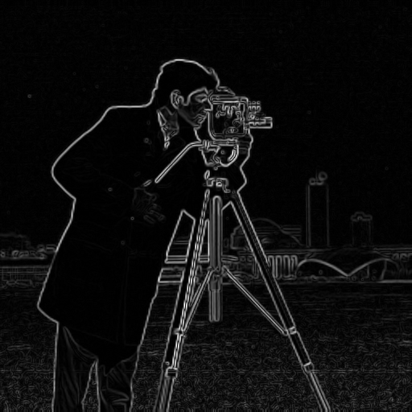
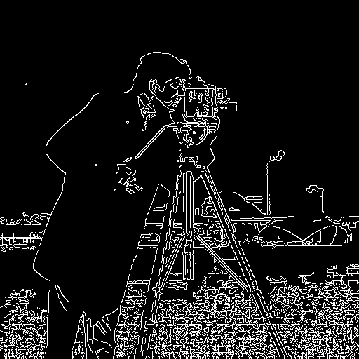
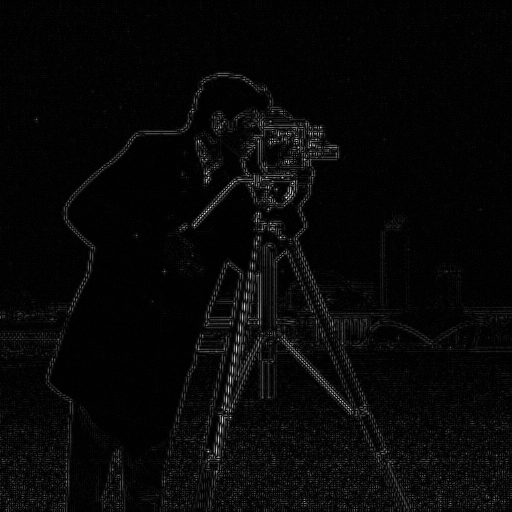
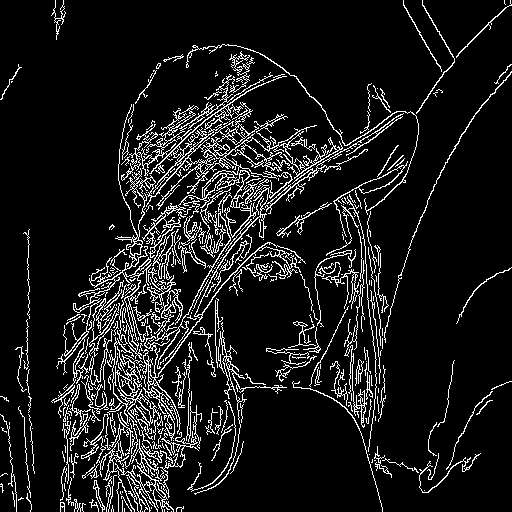
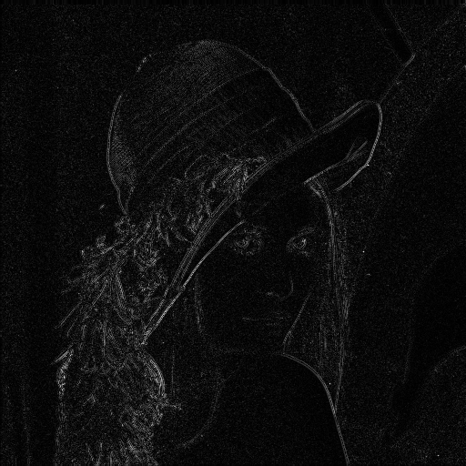

# Informe Escrito

## Autor

| **Nombre y Apellidos** |         **Correo**         |               **GitHub**               |
| :--------------------: | :------------------------: | :------------------------------------: |
|  Ariel Plasencia Díaz  | arielplasencia00@gmail.com | [@ArielXL](https://github.com/ArielXL) |

## Notas de la tarea

La tarea consiste en la comparación de una imagen digital en escala de grises con su respectiva imagen, pero con los bordes resaltados, en cuanto a varios algoritmos que miden la calidad de las imágenes digitales.

### Implementación

La tarea está implementada en [python 3](https://es.wikipedia.org/wiki/Python). Nos apoyamos fundamentalmente en las librerías [pil](https://pillow.readthedocs.io/en/stable/reference/Image.html), [numpy](https://numpy.org/doc/stable/), [matplotlib](https://matplotlib.org/stable/tutorials/introductory/usage.html#sphx-glr-tutorials-introductory-usage-py), [opencv](https://opencv-python-tutroals.readthedocs.io/en/latest/py_tutorials/py_tutorials.html) y [skimage](https://scikit-image.org/docs/dev/user_guide.html).

Para la instalación de las mismas ejecutamos el siguiente comando:

```bash
pip install -r requirements.txt
```

### Ejecución

Para ejecutar nuestra propuesta de implementación escribimos en una terminal abierta en este mismo directorio:

```bash
cd src/
python main.py
```

En la carpeta [img](./img/) podemos encontrar varias imágenes de muestra. Nuestra tarea fue probada con la imagen digital [cameraman](./img/cameraman.tif), muy conocida y reconocida en la literatura consultada. También dejamos al usuario la elección de tres algoritmos para el resaltado de los bordes, el cual debe especificar al ejecutar esta tarea.

## Detección de bordes en imágenes digitales

### Algoritmo mediante el operador Canny

* Es un operador desarrollado por John F. Canny en 1986.

* Es un algoritmo de múltiples etapas para detectar una amplia gama de bordes en imágenes.

* Utiliza el cálculo de variaciones, una técnica que encuentra la función que optimiza un funcional indicado. La función óptima en el algoritmo  de Canny es descrito por la suma de cuatro términos exponenciales, pero  se puede aproximar por la primera derivada de una gaussiana.

* Podemos encontrar nuestra propuesta de implementación [aquí](./src/edge_detection/canny.py).

### Algoritmo mediante el operador Sobel

* Es un operador diferencial discreto que calcula una aproximación al gradiente de la función de intensidad de una imagen. Para cada punto de la imagen a procesar, el resultado del operador Sobel es tanto el vector gradiente correspondiente como la norma de este vector.

* Calcula el gradiente de la intensidad de una imagen en cada píxel. Así, para cada píxel, este operador da la magnitud del mayor cambio  posible, la dirección y el sentido desde oscuro a claro.

* Podemos encontrar nuestra propuesta de implementación [aquí](./src/edge_detection/sobel.py).

### Algoritmo mediante el operador Laplace

* Es un operador diferencial de segundo orden con invariancia de rotación.

* Es fácilmente afectado por el ruido.

* No puede detectar la dirección del borde, generalmente no se usa directamente para detectar bordes, sino para juzgar cambios entre claros y oscuros.

* Se usa principalmente para determinar si los píxeles de borde se tratan como áreas brillantes u oscuras de la imagen.

* Podemos encontrar nuestra propuesta de implementación [aquí](./src/edge_detection/laplace.py).

## Medidas para medir la calidad de las imágenes

### Error cuadrático medio (mean squared error)

1. Lo llamaremos *MSE* (mean squared error) por sus siglas en inglés.

2. Es un estimador que mide el promedio de los errores al cuadrado, es decir, la diferencia entre el estimador y lo que se estima.

3. Es una función de riesgo correspondiente al valor esperado de la pérdida del error al cuadrado.

4. Cuanto menor sea el valor de *MSE*, mejor será la calidad de la imagen reconstruida.

5. Dada una imagen $I$ cuyas dimensiones son $m × n$ y su aproximación $K$ . El error cuadrático
   medio se define como:
$$
MSE = \frac{1}{m n} \sum_{i = 0}^{m -1} \sum_{j = 0}^{n - 1} (I(i, j) - K(i, j))^2
$$

### **Proporción máxima de señal a ruido** (peak signal-to-noise ratio)

1. Lo llamaremos *PSNR* (peak signal-to-noise ratio) por sus siglas en inglés.

2.  Evalúa la relación entre la imagen y el ruido luego de aplicar algoritmos de mejora de la calidad de la imagen.

3. Se expresa generalmente en escala logarítmica, utilizando como unidad el decibelio.

4. Cuanto más alto sea el *PSNR*, mejor será la calidad de la imagen reconstruida.

5. Se define como:
   $$
   PSNR = 20 \log_{10}({MAX_{I}}) - 10 \log_{10}({MSE})
   $$
   donde $MAX_{I}$ es el máximo valor posible de píxeles en la imagen.
   

### Índice de similitud estructural (structural similarity)

1. Lo llamaremos *SSIM* (structural similarity) por sus siglas en inglés.

2. Se utiliza para medir la similitud entre dos imágenes y se basa en la sistema de visión humana.

3. Es un modelo basado en  la percepción que considera la degradación de la imagen como un cambio  percibido en la información estructural, al tiempo que incorpora  importantes fenómenos de percepción, incluidos términos de  enmascaramiento de luminancia y enmascaramiento de contraste.

4. La diferencia con medidas como *MSE* o *PSNR* es que estos enfoques se computan con información global de toda la imagen.

5. Se calcula en varias ventanas de una imagen. La medida entre dos ventanas $x$ y $y$ de igual tamaño $N x N$ es:
    $$
    SSIM(x, y) = \frac{(2 \mu_{x} \mu_{y} + c_{1})(2 \sigma_{xy} + c_{2})}{(\mu_{x}^{2} + \mu_{y}^{2} + c_{1})(\sigma_{x}^{2} + \sigma_{y}^{2} + c_{2})}
    $$
    donde $\mu_{x}$ es la media de $x$, $\mu_{y}$ es la media de $y$, $\sigma_{x}^{2}$ es la varianza de $x$, $\sigma_{y}^{2}$ es la varianza de $y$, $\sigma_{xy}^{2}$ es la covarianza de $x$ y $y$, $c_{1} = (k_{1}L)^{2}$ y $c_{2} = (k_{2}L)^{2}$ son dos variables para estabilizar la división en el denominador, $L$ es el rango dinámico de la imagen (diferencia entre la mayor y menor intensidad de gris), $k_{1} = 0.01$ y $k_{2} = 0.03$ son tomados valores por defecto.

## Resultados

**Imagen original / Imagen bordes** | **Algoritmo para la detección de bordes** | **MSE** | **PSNR (dB)** | **SSIM**
:-:|:-:|:-:|:-:|:-:
 | *sobel* | $2474.398$ | $14.196$ | $0.431$ 
 | *canny* | $0.098$ | $58.236$ | $1.000$ 
 | *laplace* | $347.745$ | $22.718$ | $0.872$ 


**Imagen original / Imagen bordes** | **Algoritmo para la detección de bordes** | **MSE** | **PSNR (dB)** | **SSIM**
--|:-:|:-:|:-:|:-:
 | *sobel* | $2868.850$ | $13.554$ | $0.307$ 
 | *canny* | $0.102$ | $58.058$ | $1.000$ 
 | *laplace* | 464.503 | 21.461 | 0.693

